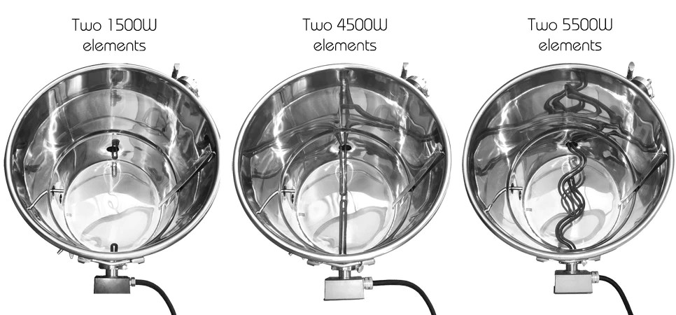
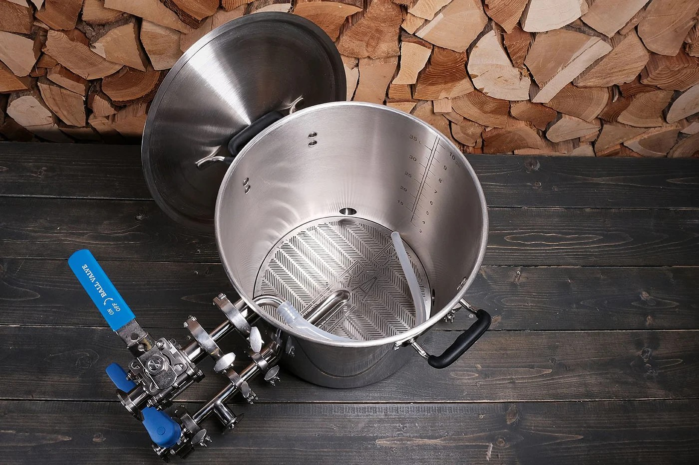
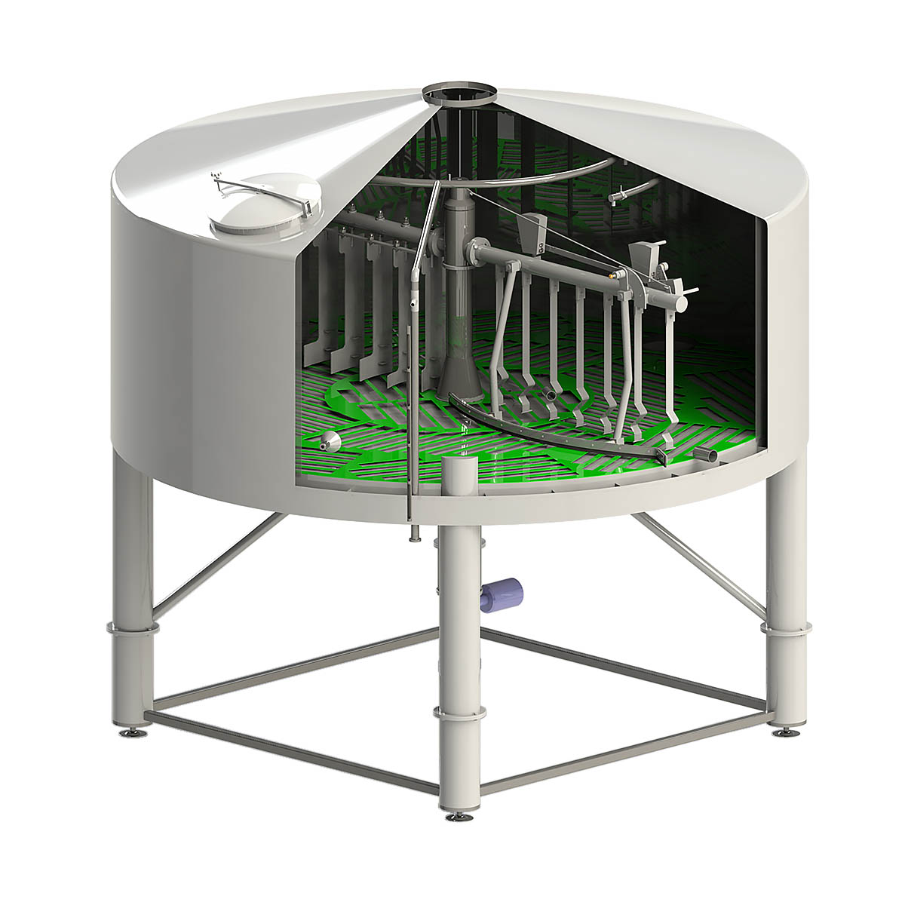
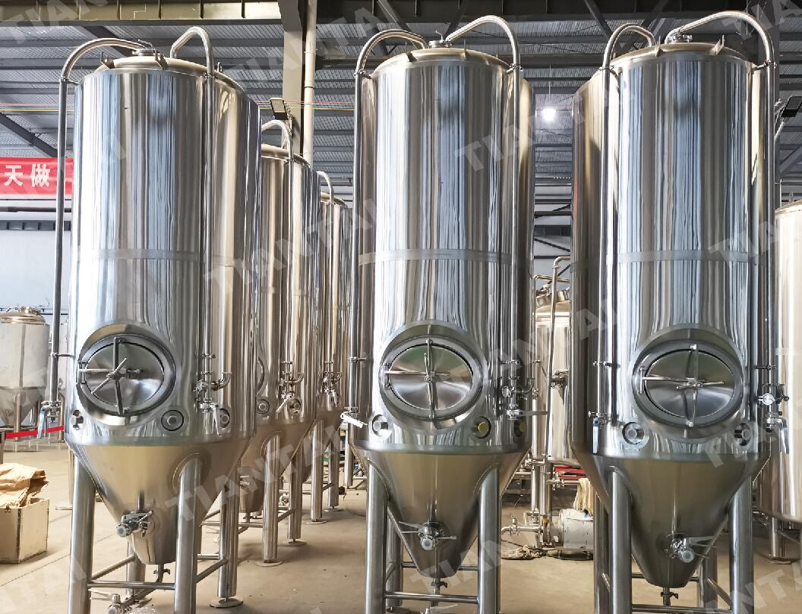
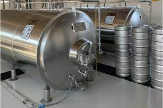

 # virutalization-git-homebrew

#### A few ideas and inspiration for the homebrewer.
----------

### Recipe's

- [Racer 5 IPA Clone recipe in Beer XML](Racer5IPAClone.xml)
- [Sierra Nevada Pale Ale Clone in Beer XML](SierraNevadaPaleAleClone.xml)

---

### A few Recipe Ideas

 [Pale Ale](recipe1.txt)

 [Saison](recipe2.txt)

 [Mild](recipe3.txt)

---
---

## Pictures
---

#### Boil Kettle options:

#### Mash Tun

#### Lauter Tun (larger scale brewery)

#### Fermentation Tanks (large scale brewery)

#### Lagering Tank (large scale brewery)
